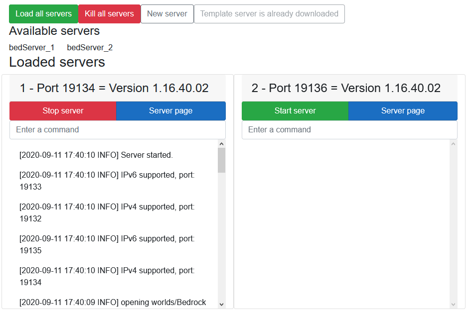
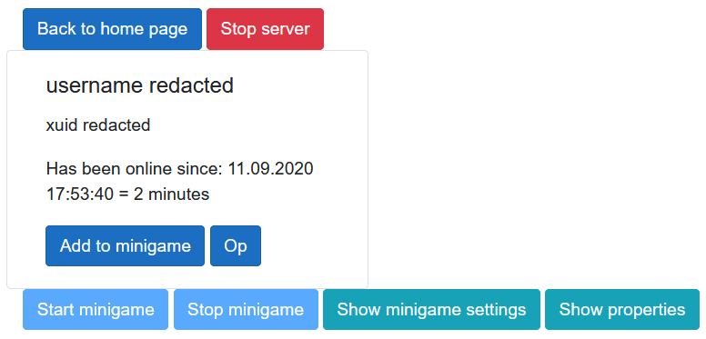

# Multiple servers configurator, microgames and more - Wrapper for Minecraft Bedrock Edition server program

# Table of contents
* [Introduction](#introduction)
* [Features](#features)
* [Getting started, license and disclaimer](#more-information)

# Introduction

## What is this
This is basically a wrapper which adds a lot of functionality for MineCraft Bedrock Edition server program

## Why did I make this
I coded this because Bedrock edition doesn't get as much love as Java edition in my opinion. That's why I decided to see what's possible just by using the default server program and extending the functionality noninvasively thanks to this code.

## What is my goal with this program
I'm hoping more people would join the development and extend it as much as possible. My main goal is to write clean and extendable code and I'm happy for any feedback and criticism you have for me. I love to learn and improve.

## What you can do with it
If you've ever seen YouTube videos or streams of people where they, for example, get a donation and something happens to them while they're playing Minecraft based on the donation amount, you can do something like that too with this code. Simply start up a server with a Configurator, get the server instance, create an instance of ServerApi and it's up to you to use it with whatever you want. You can create a discord bot where if someone sends a command, creepers will spawn on you for example. Imagination is your limitation.

# Features

## Running multiple servers
The main feature of this code is that you're able to run multiple servers on a single computer. Configurator takes care of assigning unique ports to servers that won't change unless you tell it to (which I don't recommend).

## Microgames
Thanks to Minigame class which controls microgames, you can add some challenge when you're playing with others. Code is packaged with 3 microgames that either, teleport you high up in the air, spawn random mobs on you or give you some sort of effect. Check out BlazorApp/Pages/Components/MinigameController.razor to see its functionality.

## Displaying players in a server
Gives you the ability to view connected players on a specific server. You can also see how long they've been connected for, last time they connected and more. 

## Sending commands
Allows you to send commands to a specific server, but you can use and extend ServerApi class then call its methods so you don't have to write commands yourself on the UI every time you want use them.

## Plans for future features
You will be able to - whitelist players, update servers with new version and more

# More information

## Getting started
If you're interested in how this code works in a simple way, go check out Program class in ConsoleApp project. It shows how to easily start 2 servers and includes information and tips that should help you get started in developing.

## License
[MIT License](LICENSE)

## Disclaimer
Not affiliated in any way with Mojang or Minecraft.